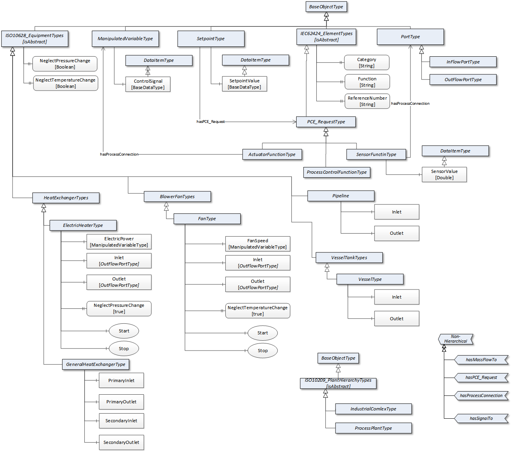

# HeatingProcess OPC UA Model

This OPC UA information model is created for the use case of a simple heating process deficted in the following figure:

The project file can be opened with the UAModeler software, available at https://www.unified-automation.com

The structure of the information model is shown in the following figure:
